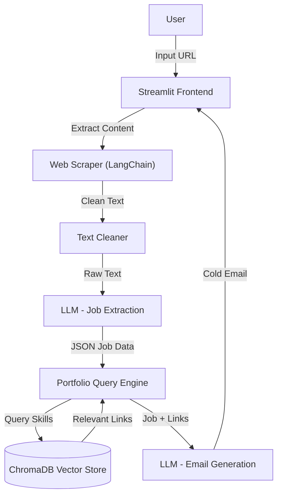

# 📧 Cold Email Generator

A specialized tool for business development professionals to generate customized cold emails based on job descriptions scraped from company career pages.

## 🚀 Overview

This application streamlines the process of reaching out to potential clients by:
1.  **Scraping** job descriptions directly from a provided URL.
2.  **Analyzing** the job requirements (role, experience, skills, description) using an LLM (Llama 3.1 via Groq).
3.  **Matching** these requirements with relevant portfolio links from a vector database (ChromaDB).
4.  **Generating** a tailored cold email that positions your services as the ideal solution.

## 🏗️ Architecture



## 🛠️ Technologies Used

-   **Frontend**: [Streamlit](https://streamlit.io/) for an interactive and clean UI.
-   **LLM Integration**: [LangChain](https://www.langchain.com/) for chaining prompts and managing LLM interactions.
-   **Model**: [Groq](https://groq.com/) API running **Llama 3.3 70B Versatile** for high-speed inference.
-   **Database**: [ChromaDB](https://www.trychroma.com/) for vector storage and semantic search of portfolio items.
-   **Data Handling**: [Pandas](https://pandas.pydata.org/) for managing portfolio data.

## ⚙️ Setup & Installation

1.  **Clone the repository**:
    ```bash
    git clone <repository-url>
    cd cold-email-generation-tool
    ```

2.  **Create a virtual environment** (optional but recommended):
    ```bash
    python -m venv venv
    # Windows
    venv\Scripts\activate
    # macOS/Linux
    source venv/bin/activate
    ```

3.  **Install Dependencies**:
    ```bash
    pip install -r app/requirements.txt
    ```

4.  **Environment Configuration**:
    Create a `.env` file in the `app` directory (or ensure `app/.env` exists) with your Groq API key:
    ```env
    groq_api_key='your_groq_api_key_here'
    ```

## 🏃‍♂️ Usage

1.  **Run the Application**:
    Navigate to the project root and run:
    ```bash
    streamlit run app/main.py
    ```

2.  **Generate Emails**:
    -   Open the URL provided in the terminal (usually `http://localhost:8501`).
    -   Enter the URL of a job posting (e.g., a careers page).
    -   Click **Submit**.
    -   View the generated cold email(s) tailored to that specific job.

## 📁 Project Structure

```
cold-email-generation-tool/
├── app/
│   ├── chains.py          # LLM chains for extraction and email generation
│   ├── main.py            # Streamlit application entry point
│   ├── portfolio.py       # Portfolio management and vector store interaction
│   ├── utils.py           # Text cleaning utilities
│   ├── resource/          # Data resources
│   │   └── portfolio.csv  # CSV containing portfolio links and tech stacks
│   ├── .env               # Environment variables (API keys)
│   └── requirements.txt   # Project dependencies
├── vectorstore/           # Persisted ChromaDB data
└── README.md              # Project documentation
```
